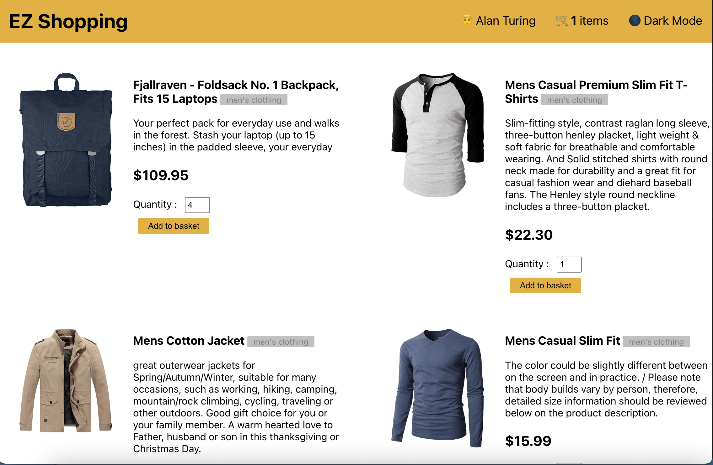
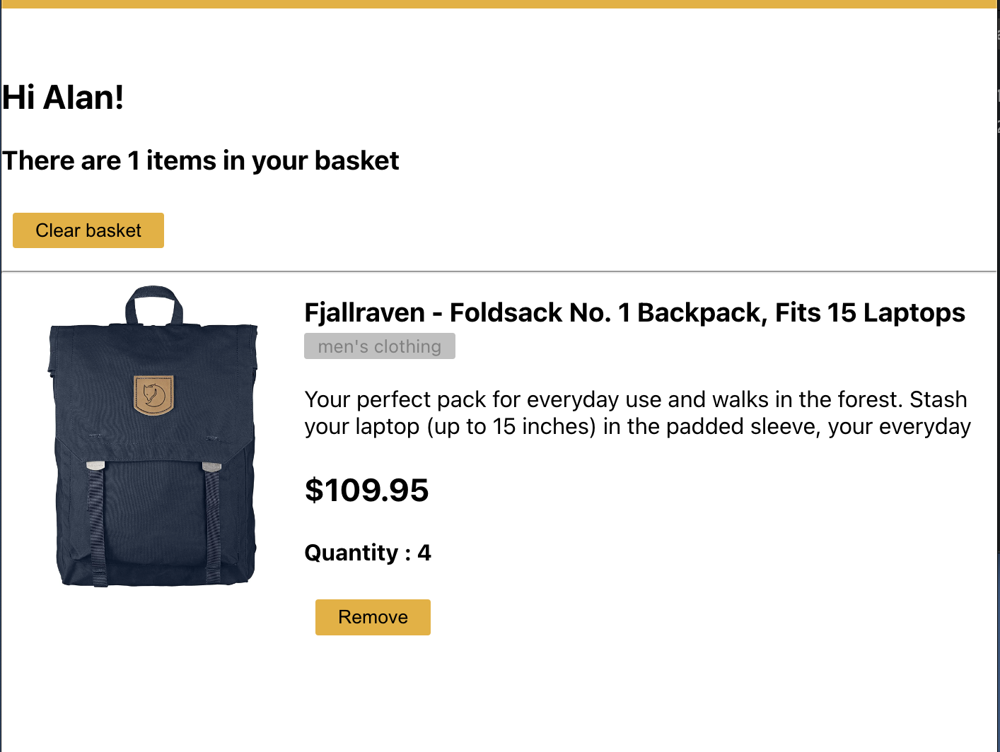
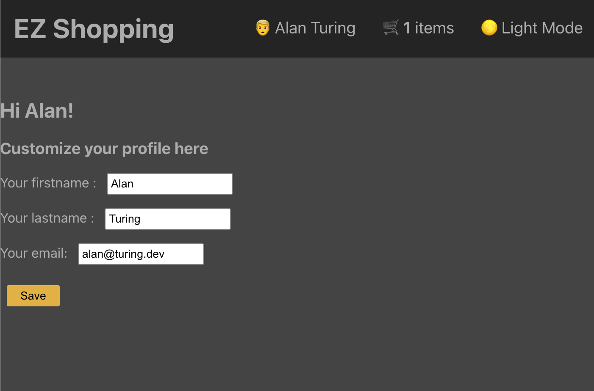

# Projet EZ Shopping

Vous devez réaliser ce projet par équipe de 2.

Vous utiliserez **reduxtoolkit** ou **redux** pour gérer le state de l'application.

Vous utiliserez react router pour gérer les routes.

Pour les CSS.

Vous utiliserez l'API suivante pour les données :

```txt
https://fakestoreapi.com/docs#p-all
```

Vous allez développer l'ensemble des fonctionnalités décrites ci-dessous

## 1 Page principale

Récupérez tous les produits et affichez les dans la page principale :



Chaque produit est constitué d'un titre, d'une description, d'une image, la catégorie du produit et son prix.

On peut définir la quantité d'un produit et l'ajouter dans le panier, si on ajoute un produit dans le panier la quantité de produit(s) commandé(s) se met à jour dans la menu princpal.

Dans le menu sur cette page vous aurez les items suivants : le nom de la personne connectée, la quantité de produit(s) commandé(e) et un mode light/dark.

## 2 Le pannier

Dans le menu l'item panier est cliquable, une fois cliqué, on est redirigé vers la page qui affiche l'ensemble des/du produit(s) commandé(s).



Sur cette page,

1. on peut continuer à modifier la quantité du/des produit(s) commandé(s).

2. Retirer un produit.

3. Retirer l'ensemble des produits.

4. Valider le panier, dans ce cas réfléchissez à un storage persistant pour garder en mémoire l'ensemble des produits.Vous pouvez utiliser MongoDB, un localStorage ou MySQL.

## 3 Page de l'utilisateur

Dans le menu on peut cliquer sur le nom de l'utilisateur et changer ces informations.



## 4 Option ligth/nigth

Implémentez la fonctionnalité pour changer l'option ligth/dark de l'application. 
